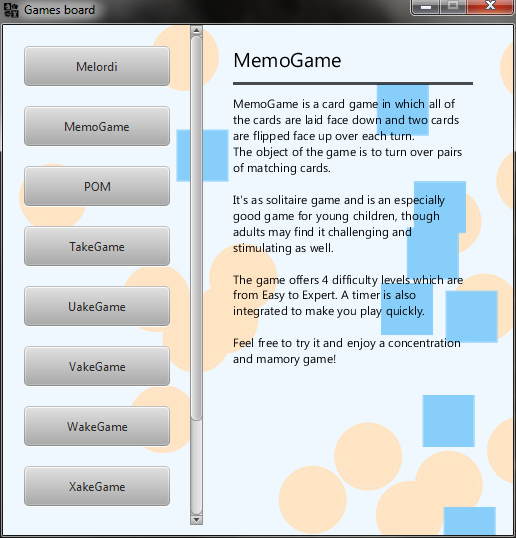
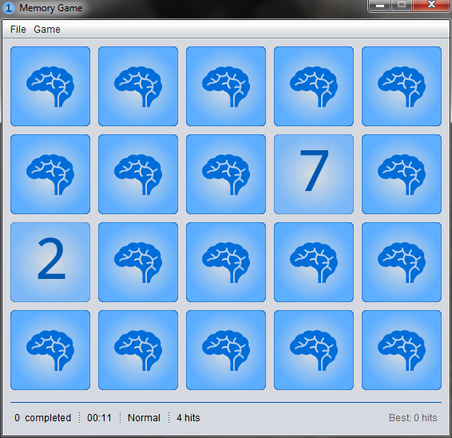

# TP-Plateforme-Java-2014

Source code of Plateform Java projects 3A

***

To launch the Games board, execute `demo/Launcher.jar` file.  
Put your games JAR in `demo/games/`to add or remove new games.
